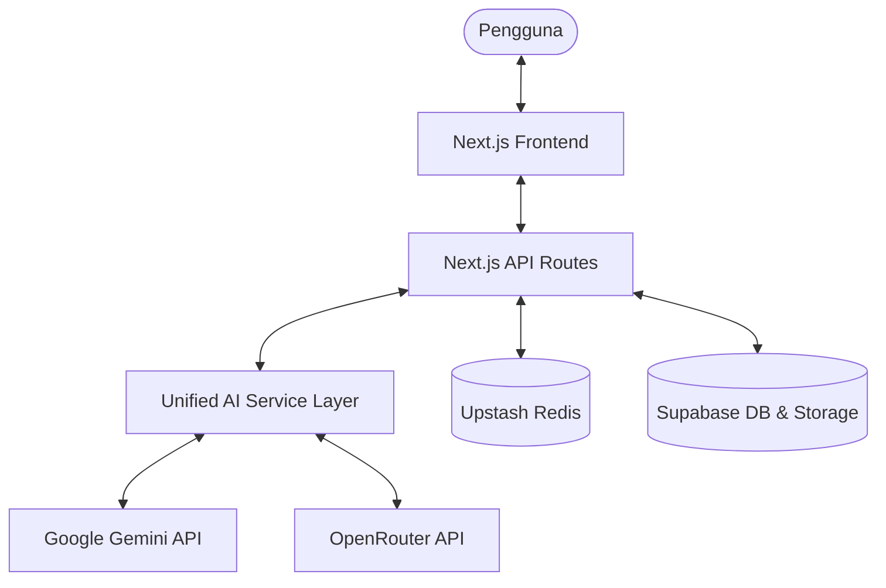

# Arsitektur Sistem MIKOCHAT-AI

Dokumen ini menjelaskan bagaimana berbagai komponen dalam MIKOCHAT-AI bekerja sama untuk memberikan pengalaman chat AI yang lancar.

## Diagram Alur Tingkat Tinggi

## Komponen Utama

### 1. Lapisan Frontend (Next.js App Router)
- **Halaman (`/chat`, `/`)**: Menggunakan Client Components untuk interaktivitas chat yang tinggi.
- **State Management**: Menggunakan React Hooks (`useState`, `useRef`, `useEffect`) untuk mengelola status chat lokal, input pengguna, pemilihan model, dan status streaming.
- **UI Components**: Dibangun dengan Tailwind CSS, Framer Motion, dan Lucide Icons untuk desain yang modern dan responsif.

### 2. Lapisan API (Backend)
- **Processing Layer (`/api/chat`)**: Menangani orkestrasi awal, termasuk pengunduhan lampiran dari Storage, ekstraksi teks, dan penyiapan konteks dokumen.
- **Execution Layer (`/api/data`)**: Inti dari logika backend. Mengelola rate limiting, caching, dan komunikasi streaming dengan AI Service.
- **Streaming Engine**: Menggunakan Web Streams API untuk mengirimkan potongan teks AI secara real-time ke klien.

### 3. Unified AI Service Layer (`src/lib/services/ai-service.ts`)
- Berfungsi sebagai jembatan (abstraction layer) antara API Route dan berbagai penyedia AI.
- **Normalisasi**: Memastikan riwayat pesan dikonversi ke format yang tepat untuk setiap SDK (misalnya, peran `model` untuk Gemini vs `assistant` untuk OpenRouter).
- **Multi-Provider**: Mendukung pemilihan model secara dinamis dari Google (Gemini) dan OpenRouter (Claude, GPT-4o, Llama).

### 4. Layanan Data & Penyimpanan
- **Google Gemini & OpenRouter**: Bertindak sebagai mesin kecerdasan. Pengguna dapat memilih model favorit mereka.
- **Supabase**: Bertindak sebagai sumber kebenaran (Source of Truth) untuk data persisten. Pesan dan metadata chat disimpan di PostgreSQL.
- **Upstash Redis**: Digunakan sebagai lapisan performa. Menyimpan kunci rate-limit dan cache hasil AI untuk mengurangi biaya API dan meningkatkan waktu respons.

## Alur Kerja Analisis Dokumen

MIKOCHAT-AI memiliki fitur analisis dokumen cerdas:

1. **Upload**: Pengguna mengunggah file (PDF/Word/TXT) melalui UI.
2. **Storage**: File disimpan di Supabase Storage.
3. **Extraction**: Saat chat dikirim, API mengunduh file, mengekstrak teksnya, dan membaginya menjadi beberapa bagian (chunking).
4. **Contextual Prompt**: Teks yang relevan dimasukkan ke dalam prompt sistem sebagai konteks pengetahuan tambahan.
5. **Response**: AI menjawab pertanyaan berdasarkan konteks dari dokumen tersebut.

## Keamanan & Keandalan
- **Autentikasi**: Middleware memastikan hanya pengguna terautentikasi yang dapat mengakses chat.
- **RLS (Row Level Security)**: Diaktifkan pada Supabase untuk memastikan keamanan data antar pengguna.
- **Deduplikasi**: Menggunakan Redis Lock untuk mencegah pemrosesan pesan yang sama berkali-kali jika terjadi klik ganda.
